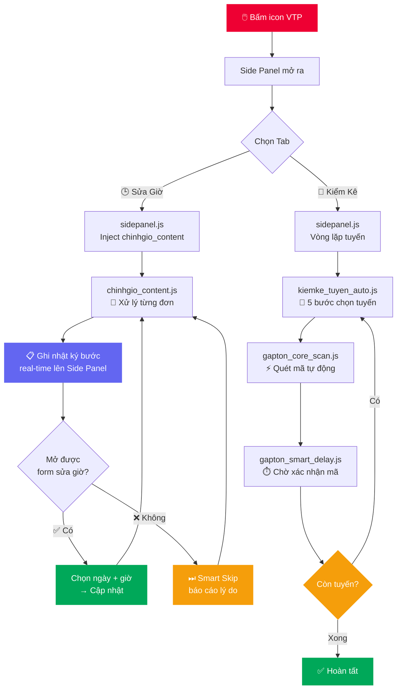

<div align="center">

<picture>
  
</picture>

<br/>

<!-- BADGES -->
<a href="#"></a>
&nbsp;
<a href="https://google.com/chrome"></a>
&nbsp;
<a href="LICENSE"></a>
&nbsp;
<a href="mailto:duongthaitan13@gmail.com"></a>

<br/><br/>


&nbsp;

&nbsp;

&nbsp;


<br/><br/>

> **🕒 Sửa giờ lấy hàng hàng loạt · 🚛 Kiểm kê tồn theo tuyến tự động**
>
> *Tiết kiệm hàng giờ thao tác thủ công — không cần biết lập trình.*

<br/>

[📥 Cài đặt ngay](#-hướng-dẫn-cài-đặt) &ensp;·&ensp; [📖 Hướng dẫn](#-cẩm-nang-sử-dụng) &ensp;·&ensp; [❓ FAQ](#-câu-hỏi-thường-gặp) &ensp;·&ensp; [🐛 Báo lỗi](mailto:duongthaitan13@gmail.com)

</div>

---

## 📑 Mục lục

| # | Mục | Mô tả |
|:-:|-----|-------|
| 1 | [🌟 Tính năng](#-tính-năng) | 2 chức năng tự động hóa trong một Side Panel |
| 2 | [🚀 Cài đặt](#-hướng-dẫn-cài-đặt) | 4 bước đơn giản, không cần lập trình |
| 3 | [💡 Sử dụng](#-cẩm-nang-sử-dụng) | Hướng dẫn chi tiết từng chức năng |
| 4 | [📂 Kiến trúc](#-cấu-trúc-mã-nguồn) | Sơ đồ luồng và cấu trúc thư mục |
| 5 | [❓ FAQ](#-câu-hỏi-thường-gặp) | Giải đáp lỗi phổ biến |
| 6 | [👨‍💻 Tác giả](#-tác-giả--hỗ-trợ) | Thông tin liên hệ |

---

## 🌟 Tính năng

> Một Chrome Extension duy nhất với **2 chức năng chính** dạng **Side Panel** (hiện ra bên phải màn hình, không che khuất trang web).

<br/>

<table>
<tr>
<td width="50%" valign="top">

### 🕒 Chức năng 1
### Sửa Giờ Lấy Hàng

---

**📂 2 nguồn mã đơn linh hoạt**
- **File Excel (.xlsx)** — load file tồn → group theo `TEN_KHGUI` → chọn 1 khách → tool tự lấy `MA_PHIEUGUI` của khách đó.
- **Dán mã trực tiếp** — paste danh sách mã (mỗi dòng / phẩy / tab). Tự khử trùng lặp.

**🤖 Tự động 6 bước mỗi đơn**
Tìm kiếm mã → mở menu → "Sửa đơn" → "Chọn thời gian" → chọn ngày + khung giờ "Cả ngày" → "Cập nhật" → sang đơn tiếp theo.

**📋 Nhật ký thao tác real-time** *(Mới)*
Card "Nhật ký thao tác" hiển thị từng bước đang chạy ngay trên Side Panel — biết tool đang ở đâu, đơn nào, thành công hay bỏ qua.

**🛡️ Smart Skip + an toàn DOM**
Tự phát hiện đơn không hỗ trợ sửa giờ → bỏ qua sạch. Khi mạng chậm, ưu tiên **skip an toàn** thay vì thao tác sai (không đặt nhầm ngày, không cập nhật thiếu giờ).

**📊 Báo cáo kết quả**
Cuối phiên hiện card 2 tab **"Thất bại / Thành công"** — list từng mã + lý do, nút **Copy** ra clipboard.

**⚙️ Tuỳ chỉnh độ trễ**
Cài delay (giây) ngay trên UI — tăng khi mạng chậm để tránh sót đơn.

</td>
<td width="50%" valign="top">

### 🚛 Chức năng 2
### Kiểm Kê Tồn Tuyến

---

**🗂️ Chọn nhiều tuyến**
Tải danh sách tuyến trực tiếp từ dropdown VTP, chọn một hoặc nhiều tuyến cùng lúc (có "Chọn tất cả").

**🤖 Tự động 6 bước mỗi tuyến**
Chọn tuyến → Tìm kiếm → Tạo phiếu kiểm kê → Xác nhận → **Chuyển tab chưa kiểm kê** → Quét toàn bộ mã.

**🔄 Vòng lặp liên tục**
Hoàn tất một tuyến → tự động F5 → sang tuyến kế tiếp — không cần can thiệp.

**📈 Progress đa tuyến**
Thanh tiến trình + thời gian chạy (elapsed) + ước tính còn lại (ETA), hiển thị tuyến đang xử lý.

**⚡ Quét Mã Thủ Công**
Nút riêng để quét nhanh ngay trên trang kiểm kê mà không chạy toàn bộ quy trình tuyến.

**🖥️ HUD Overlay + Lọc mã thông minh**
Bảng nổi real-time hiển thị tổng đã quét, lịch sử từng mã, phân trang tự động, và nhận diện các đầu mã hợp lệ (`SHOPEE`, `VTP`, `VGI`, `PKE`, `KMS`, `PSL`, `TPO`…).

</td>
</tr>
</table>

<br/>

> [!TIP]
> **Bảo mật tuyệt đối:** Toàn bộ xử lý diễn ra **100% trên trình duyệt của bạn**. Extension không có server backend, không thu thập hay gửi bất kỳ dữ liệu nào ra ngoài.

---

## 🚀 Hướng dẫn cài đặt

> [!NOTE]
> **Không cần biết lập trình.** Chỉ cần làm theo 4 bước — mất khoảng **30 giây**.

<br/>

```
Bước 1          Bước 2                  Bước 3               Bước 4
   │                │                      │                     │
Tải ZIP        chrome://             Developer Mode        Load Unpacked
GitHub     ──► extensions/   ──►    Bật công tắc   ──►   Chọn thư mục ✅
Download                              (góc phải)           đã giải nén
```

<br/>

**① Tải source code**

Nhấn nút **`<> Code`** (màu xanh lá) → chọn **`Download ZIP`** → giải nén ra một thư mục.

**② Mở trang quản lý tiện ích**

| Trình duyệt | Địa chỉ |
|:-----------:|:--------|
| Chrome | `chrome://extensions/` |
| Edge | `edge://extensions/` |

**③ Bật Developer Mode**

Gạt công tắc **`Chế độ dành cho nhà phát triển`** ở góc trên bên phải sang `ON`.

**④ Nạp tiện ích**

Bấm **`Tải tiện ích đã giải nén`** → chọn thư mục gốc vừa giải nén (thư mục chứa `manifest.json`).

<br/>

> [!TIP]
> ✅ **Xong!** Nhấn biểu tượng VTP trên thanh công cụ — **Side Panel** sẽ hiện ra bên phải màn hình.

> [!IMPORTANT]
> Extension chỉ hoạt động trên **mạng nội bộ ViettelPost** (`viettelpost.vn`, `viettelpost.com.vn`). Khi test, có thể dùng server giả lập trong thư mục `tools/test_server/`.

---

## 💡 Cẩm nang sử dụng

### 🕒 Chức năng Sửa Giờ Lấy Hàng

```
[1] Bấm icon VTP → Side Panel mở ra bên phải
[2] Chọn tab "Sửa Giờ"
[3] Chọn nguồn mã:
    ┌─────────────────────────┬──────────────────────┐
    │ 📂 File Excel           │ 📋 Dán mã            │
    │ Chọn .xlsx (cột         │ Paste mã (mỗi dòng / │
    │ TEN_KHGUI + MA_PHIEUGUI)│ phẩy / tab cũng OK)  │
    │ → chọn khách hàng       │ Tự khử trùng lặp     │
    └─────────────────────────┴──────────────────────┘
[4] Cài Độ Trễ (mặc định 4s — tăng khi mạng chậm)
[5] Bấm ▶ BẮT ĐẦU CHẠY
         ↓
    Tool tự xử lý tuần tự từng mã trên tab hiện tại 🤖
    Card "Nhật ký thao tác" hiển thị từng bước real-time 📋
         ↓
    Đơn không hỗ trợ sửa giờ → tự động bỏ qua ⏭ (Smart Skip)
         ↓
    ✅ Hoàn thành — Card "Báo cáo" hiện list:
       • Tab "Thất bại" — mã + lý do skip + nút Copy
       • Tab "Thành công" — mã đã cập nhật xong
```

> [!TIP]
> File Excel cần có **đúng 2 cột bắt buộc**: `TEN_KHGUI` (tên khách hàng) và `MA_PHIEUGUI` (mã vận đơn). Tool sẽ group đơn theo từng khách → bạn pick 1 khách để chạy batch của khách đó.

> [!WARNING]
> Trong khi tool đang chạy, **không chuyển tab** hoặc **click vào trang web**. Nếu mạng yếu, tăng Delay lên **8–10 giây**.

---

### 🚛 Chức năng Kiểm Kê Tồn Tuyến

```
[1] Mở trang kiểm kê bưu phẩm ViettelPost
         ↓
[2] Bấm icon VTP → Chọn tab "Kiểm Kê Tồn"
         ↓
[3] Bấm "Tải danh sách tuyến từ VTP"
         ↓
[4] Tick chọn các tuyến cần kiểm kê (hoặc "Chọn tất cả")
         ↓
[5] Bấm ▶ CHẠY KIỂM KÊ TỰ ĐỘNG
         ↓
    Với mỗi tuyến, tool thực hiện 6 bước tự động:
    ┌──────────────────────────────────────────────────┐
    │  Bước 1: Chọn tuyến trong dropdown               │
    │  Bước 2: Click Tìm kiếm                          │
    │  Bước 3: Click Kiểm kê (tạo phiếu)               │
    │  Bước 4: Xác nhận trong hộp thoại                │
    │  Bước 5: Chuyển sang tab "Bưu phẩm chưa kiểm kê" │
    │  Bước 6: Quét toàn bộ mã tự động                 │
    └──────────────────────────────────────────────────┘
         ↓
    Xong tuyến → F5 trang → chuyển tuyến kế tiếp → lặp lại...
         ↓
    ✅ Hoàn tất tất cả tuyến đã chọn
```

> [!TIP]
> Muốn quét nhanh mà không chạy cả quy trình tuyến? Vào tab "Kiểm Kê Tồn" → bấm **📦 Quét Mã Thủ Công**. Bảng HUD nổi sẽ hiện ở góc dưới phải, tự quét và lật trang.

> [!WARNING]
> **Không thao tác chuột / bàn phím** khi tool đang chạy tự động.

---

## 📂 Cấu trúc mã nguồn

```
📁 VTP-Auto-GapTon-HenGioLayHang/
│
├── 📄 manifest.json             ← [CORE]   Cấu hình Extension MV3 + khai báo Side Panel
├── 📄 background.js             ← [CORE]   Service worker: mở Side Panel khi click icon
├── 📄 README.md
│
├── 📁 src/
│   ├── 📁 ui/
│   │   ├── 📄 sidepanel.html    ← [UI]     Giao diện Side Panel 2 tab (VTP Red/White)
│   │   ├── 📄 sidepanel.css     ← [UI]     ViettelPost brand system, 8px grid
│   │   └── 📄 sidepanel.js      ← [LOGIC]  Điều phối tab, inject script, vòng lặp + nhật ký
│   │
│   ├── 📁 modules/
│   │   ├── 📁 chinhgio/                          ← CHỨC NĂNG 1 — SỬA GIỜ
│   │   │   └── 📄 chinhgio_content.js  ← Engine sửa giờ + Smart Skip + log real-time
│   │   │
│   │   └── 📁 kiemke/                            ← CHỨC NĂNG 2 — KIỂM KÊ TỒN
│   │       ├── 📄 kiemke_tuyen_auto.js ← 5 bước chọn tuyến → vào trang scan
│   │       ├── 📄 gapton_settings.js   ← Cấu hình prefix mã hợp lệ
│   │       ├── 📄 gapton_smart_delay.js← Chờ DOM thay đổi (MutationObserver)
│   │       └── 📄 gapton_core_scan.js  ← Engine quét mã + HUD + phân trang
│   │
│   └── 📁 shared/
│       ├── 📄 notification.js          ← [SHARED]  Toast Notification (thay thế alert)
│       └── 📄 xlsx_parser.js           ← [SHARED]  Đọc .xlsx (vanilla, no SheetJS)
│
├── 📁 assets/icons/             ← icon16/48/128.png
├── 📁 docs/screenshots/         ← Ảnh chụp UI tham khảo
└── 📁 tools/test_server/        ← Server giả lập VTP (dev only, gitignored)
```

<br/>



---

## ❓ Câu hỏi thường gặp

<details>
<summary><b>🔴 Tool báo "Chưa sẵn sàng" dù đang ở trang ViettelPost?</b></summary>

<br/>

Tool kiểm tra URL của tab hiện tại. Hãy đảm bảo domain là:
- `viettelpost.vn`
- `evtp2.viettelpost.vn`
- `localhost` (khi test với server giả lập)

**Giải pháp:** Nhấn `F5` tải lại trang, sau đó bấm lại icon VTP để mở Side Panel.

<br/>
</details>

<details>
<summary><b>🟡 Tab Sửa Giờ bị sót đơn / chạy sai?</b></summary>

<br/>

**Nguyên nhân:** Server VTP phản hồi chậm hơn tốc độ thao tác của tool.

**Giải pháp:** Tăng **Độ trễ** theo tình trạng mạng:

| Tình trạng | Delay đề nghị |
|:----------:|:-------------:|
| Mạng tốt | `4s` (mặc định) |
| Mạng trung bình | `7–8s` |
| Mạng VPN / chậm | `10s+` |

Khi mạng chậm, tool ưu tiên **bỏ qua an toàn** thay vì thao tác sai — đơn bị bỏ qua sẽ hiện trong card Báo cáo để bạn chạy lại.

<br/>
</details>

<details>
<summary><b>🟡 Theo dõi tool đang làm gì như thế nào?</b></summary>

<br/>

Khi chạy Sửa Giờ, card **"Nhật ký thao tác"** hiển thị từng bước real-time ngay trên Side Panel:

- Bước đang thực hiện (tìm kiếm, mở form, chọn ngày, chọn giờ, cập nhật…)
- Mã đơn + thứ tự (`Đơn 3/20 · VTP000111222`)
- Màu phân biệt: xanh (thành công), vàng (bỏ qua)

Bạn có thể bấm nút thùng rác để xóa nhật ký bất cứ lúc nào.

<br/>
</details>

<details>
<summary><b>🟡 Một số đơn bị thông báo "Bỏ qua" khi sửa giờ?</b></summary>

<br/>

Đây là tính năng **Smart Skip** — hoàn toàn bình thường.

**Nguyên nhân bỏ qua phổ biến:**
- Đơn đã được giao / hoàn thành → không còn cho phép sửa giờ
- Đơn đang ở trạng thái đặc biệt (hoàn, trả, chuyển kho...)
- Form sửa đơn mở nhưng không có khu vực "Chọn thời gian"
- Mạng chậm khiến danh sách ngày / khung giờ "Cả ngày" không tải kịp

**Sau khi chạy xong,** card **Báo cáo** hiển thị **2 tab** ở Side Panel:
- **Thất bại N** — list đầy đủ mã bị bỏ qua + lý do, nút **Copy** ra clipboard
- **Thành công M** — list mã đã cập nhật xong

<br/>
</details>

<details>
<summary><b>🟡 Kiểm kê tuyến bị kẹt / không chuyển sang tuyến tiếp theo?</b></summary>

<br/>

**Kiểm tra:**
1. Mở **DevTools** (F12) → tab **Console** để xem log `[VTP]`
2. Nếu log hiện "Timeout" → tuyến đó có thể bị lỗi trên server VTP
3. Nếu không có log gì → selector ZK Framework có thể đã thay đổi

**Giải pháp:** Thử chạy lại từ đầu sau khi F5 trang. Nếu vẫn lỗi, liên hệ tác giả kèm ảnh chụp màn hình Console.

<br/>
</details>

<details>
<summary><b>🔵 Dữ liệu của tôi có bị gửi lên server không?</b></summary>

<br/>

**Không.** Extension chạy hoàn toàn **phía client (trình duyệt)**. Không có backend server, không có tracking, không gửi dữ liệu ra ngoài. Bạn có thể tự kiểm tra qua tab **Network** trong DevTools — sẽ không thấy request nào tới server lạ.

<br/>
</details>

---

## 👨‍💻 Tác giả & Hỗ trợ

<div align="center">

<br/>


### Thái Tân Dương

*Developer · ViettelPost Internal Tools*

<br/>

[](https://github.com/duongthaitan)
&nbsp;&nbsp;
[](mailto:duongthaitan13@gmail.com)

<br/>

---

### Dự án có hữu ích với bạn?

Để lại một ⭐ **Star** cho repository — chỉ mất 1 giây nhưng là động lực lớn để tiếp tục phát triển! 🙏

**Báo lỗi & góp ý:** Mở [Issue](../../issues/new) trên GitHub hoặc email trực tiếp cho tác giả.

<br/>

</div>

---

<div align="center">

<picture>
  
</picture>

<sub>

Made with ❤️ for ViettelPost by [Thái Tân Dương](https://github.com/duongthaitan) &nbsp;·&nbsp; Licensed under [MIT](LICENSE) &nbsp;·&nbsp; © 2026

</sub>

</div>
