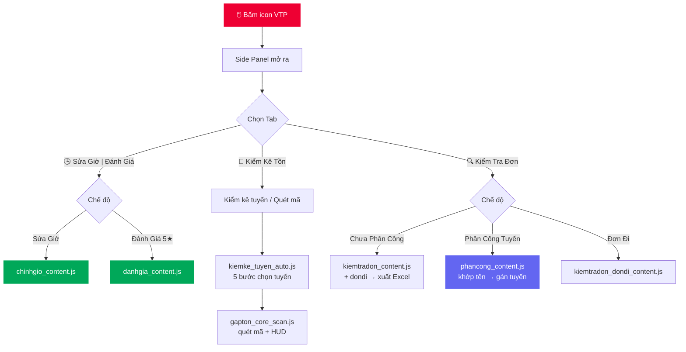

<div align="center">

<picture>
  
</picture>

<br/>

<!-- BADGES -->
<a href="#"></a>
&nbsp;
<a href="https://google.com/chrome"></a>
&nbsp;
<a href="LICENSE"></a>
&nbsp;
<a href="mailto:duongthaitan13@gmail.com"></a>

<br/><br/>


&nbsp;

&nbsp;

&nbsp;


<br/><br/>

> **🕒 Sửa giờ lấy hàng · ⭐ Đánh giá 5★ · 🚛 Kiểm kê tồn tuyến · 🔍 Kiểm tra đơn · 🧭 Phân công theo tuyến**
>
> *Tiết kiệm hàng giờ thao tác thủ công trên ViettelPost — không cần biết lập trình.*

<br/>

[📥 Cài đặt ngay](#-hướng-dẫn-cài-đặt) &ensp;·&ensp; [📖 Hướng dẫn](#-cẩm-nang-sử-dụng) &ensp;·&ensp; [❓ FAQ](#-câu-hỏi-thường-gặp) &ensp;·&ensp; [🐛 Báo lỗi](mailto:duongthaitan13@gmail.com)

</div>

---

## 📑 Mục lục

| # | Mục | Mô tả |
|:-:|-----|-------|
| 1 | [🌟 Tính năng](#-tính-năng) | 3 tab · 6 chế độ tự động hóa trong một Side Panel |
| 2 | [🚀 Cài đặt](#-hướng-dẫn-cài-đặt) | 4 bước đơn giản, không cần lập trình |
| 3 | [💡 Sử dụng](#-cẩm-nang-sử-dụng) | Hướng dẫn chi tiết từng chức năng |
| 4 | [📂 Kiến trúc](#-cấu-trúc-mã-nguồn) | Sơ đồ luồng và cấu trúc thư mục |
| 5 | [❓ FAQ](#-câu-hỏi-thường-gặp) | Giải đáp lỗi phổ biến |
| 6 | [👨‍💻 Tác giả](#-tác-giả--hỗ-trợ) | Thông tin liên hệ |

---

## 🌟 Tính năng

> Một Chrome Extension duy nhất — giao diện **Side Panel** (hiện 1/3 màn hình bên phải, không che khuất trang web), gồm **3 tab** với tổng cộng **6 chế độ tự động hóa**.

<br/>

### 🕒 Tab 1 — Sửa Giờ | Đánh Giá

<table>
<tr>
<td width="50%" valign="top">

**🕒 Sửa Giờ Lấy Hàng**

Tải file Excel tồn thu (`.xlsx`), lọc theo khách hàng, tool tự động tìm từng mã → **Sửa đơn** → chọn ngày (Cả ngày) → **Cập nhật** hàng loạt.
- **Smart Skip**: đơn không hỗ trợ sửa giờ → tự bỏ qua trong ≤ 6s.
- Vòng lặp chạy ở Side Panel → **không bị Chrome throttle** khi chuyển tab.
- Tuỳ chỉnh độ trễ, progress bar realtime.

</td>
<td width="50%" valign="top">

**⭐ Đánh Giá 5★**

Cùng danh sách mã, tool tự động mở **Thông tin bưu tá** → **Đánh giá** → chọn 5 sao → **Gửi đánh giá**.
- Tối ưu tốc độ bằng `MutationObserver` (phản ứng ngay khi DOM đổi).
- Tự đóng modal, tự bỏ qua đơn lỗi.
- Dùng chung ô nhập mã với chế độ Sửa Giờ.

</td>
</tr>
</table>

### 🚛 Tab 2 — Kiểm Kê Tồn

<table>
<tr>
<td width="50%" valign="top">

**🚛 Kiểm Kê Tuyến Tự Động**

Tải danh sách tuyến từ dropdown VTP, chọn nhiều tuyến. Mỗi tuyến tool chạy **6 bước**: chọn tuyến → Tìm kiếm → Kiểm kê → Chấp nhận → chuyển tab *Chưa kiểm kê* → **quét toàn bộ mã** → F5 sang tuyến kế tiếp.
- Progress đa tuyến + ETA, nút Dừng an toàn.

</td>
<td width="50%" valign="top">

**📦 Quét Mã Kiểm Tồn (thủ công)**

Khi đã ở trang kiểm kê, bấm để quét nhanh không cần chạy cả quy trình tuyến.
- **HUD overlay** nổi realtime: tổng đã quét, lịch sử, cài đặt prefix.
- Nhận diện đầu mã hợp lệ (`SHOPEE`, `VTP`, `VGI`, `PKE`, `KMS`, `PSL`, `TPO`…), tự phân trang.

</td>
</tr>
</table>

### 🔍 Tab 3 — Kiểm Tra Đơn

<table>
<tr>
<td width="33%" valign="top">

**🙅 Chưa Phân Công**

Tự thu thập toàn bộ đơn **chưa phân công** ở trang *Khai thác đến* → tra cứu hành trình từng đơn lấy **họ tên & địa chỉ nhận** → xuất Excel.
- Cột: STT · Mã phiếu gửi · Tên bưu tá (để trống) · Họ tên người nhận · Địa chỉ nhận · Check đủ lô F.
- **Check đủ lô F**: gom mã theo lô `<base>-<index>F<total>`, báo *Đủ lô* / *Thiếu (n/total)*.

</td>
<td width="33%" valign="top">

**🧭 Phân Công Tuyến**

Tải lại file `VTP_DonChuaPhanCong` sau khi **điền cột "Tên bưu tá"** (tên rút gọn: Nam, Hoài, Lời…).
- Tool tự **khớp tên với tuyến đầy đủ** (Nam → HBCTVT Trần Văn Nam), giữ nguyên dấu (Lời ≠ Lợi).
- Với mỗi bưu tá: Thêm mới → chọn tuyến → Ghi lại → quét từng mã → Hoàn thành → lặp.

</td>
<td width="33%" valign="top">

**📄 Đơn Đi (Excel)**

Tải file chi tiết bill, lọc theo mã khách hàng, tool tra cứu **hành trình** từng phiếu gửi trên `evtp2`.
- Lấy trạng thái, thời gian, nội dung, ghi chú, người & địa chỉ nhận.
- Hiển thị bảng kết quả + xuất Excel.

</td>
</tr>
</table>

<br/>

> [!TIP]
> **Bảo mật tuyệt đối:** Toàn bộ xử lý diễn ra **100% trên trình duyệt của bạn**. Extension không có server backend, không thu thập hay gửi bất kỳ dữ liệu nào ra ngoài.

> [!NOTE]
> **Chống Dynamic ID:** Trang ViettelPost dùng ZK Framework sinh ID ngẫu nhiên mỗi lần tải. Toàn bộ tool định vị phần tử bằng **class + text + vị trí (label)**, không phụ thuộc ID động.

---

## 🚀 Hướng dẫn cài đặt

> [!NOTE]
> **Không cần biết lập trình.** Chỉ cần làm theo 4 bước — mất khoảng **30 giây**.

<br/>

```
Bước 1          Bước 2                  Bước 3               Bước 4
   │                │                      │                     │
Tải ZIP        chrome://             Developer Mode        Load Unpacked
GitHub     ──► extensions/   ──►    Bật công tắc   ──►   Chọn thư mục ✅
Download                              (góc phải)           đã giải nén
```

<br/>

**① Tải source code** — Nhấn **`<> Code`** → **`Download ZIP`** → giải nén ra một thư mục.

**② Mở trang quản lý tiện ích**

| Trình duyệt | Địa chỉ |
|:-----------:|:--------|
| Chrome | `chrome://extensions/` |
| Edge | `edge://extensions/` |

**③ Bật Developer Mode** — Gạt công tắc **`Chế độ dành cho nhà phát triển`** ở góc trên bên phải sang `ON`.

**④ Nạp tiện ích** — Bấm **`Tải tiện ích đã giải nén`** → chọn thư mục gốc (chứa `manifest.json`).

<br/>

> [!TIP]
> ✅ **Xong!** Nhấn biểu tượng VTP trên thanh công cụ — **Side Panel** hiện ra bên phải.

> [!IMPORTANT]
> Mỗi khi **thêm/sửa file** trong extension, phải quay lại `chrome://extensions/` và bấm **↻ Reload** trên tiện ích để Chrome nạp bản mới.

---

## 💡 Cẩm nang sử dụng

### 🕒 Tab "Sửa Giờ | Đánh Giá"

```
[1] Mở trang tra cứu bưu phẩm ViettelPost
[2] Bấm icon VTP → chọn tab "Sửa Giờ | Đánh Giá"
[3] Chọn chế độ: "Sửa Giờ"  hoặc  "Đánh Giá 5★"
[4] Kéo–thả file Excel (.xlsx) → chọn khách hàng (hoặc Tất cả)
[5] Cài Độ Trễ (mặc định 4s — tăng khi mạng chậm) → ▶ Bắt Đầu Chạy
         ↓
    Tool xử lý tuần tự từng mã · đơn lỗi/không hỗ trợ → tự bỏ qua ⏭
         ↓
    ✅ Báo cáo số đơn thành công / bỏ qua
```

> [!WARNING]
> Khi tool đang chạy, **không chuyển tab** hoặc **click vào trang web**. Mạng yếu thì tăng Delay lên **8–10s**.

---

### 🚛 Tab "Kiểm Kê Tồn"

```
[1] Mở trang kiểm kê bưu phẩm ViettelPost
[2] Bấm icon VTP → tab "Kiểm Kê Tồn" → "Tải danh sách tuyến từ VTP"
[3] Tick chọn tuyến (hoặc "Chọn tất cả") → ▶ Chạy Kiểm Kê Tự Động
         ↓
    Mỗi tuyến: Chọn tuyến → Tìm kiếm → Kiểm kê → Chấp nhận
             → tab "Chưa kiểm kê" → quét toàn bộ mã → F5 → tuyến kế
         ↓
    ✅ Hoàn tất tất cả tuyến đã chọn
```

> 💡 Hoặc bấm **📦 Quét Mã Thủ Công** khi đã ở sẵn trang kiểm kê để quét nhanh (kèm HUD overlay).

---

### 🔍 Tab "Kiểm Tra Đơn"

**Chế độ 🙅 Chưa Phân Công**
```
[1] Bấm ▶ Bắt Đầu Quét
[2] Tool mở "Khai thác đến" → quét toàn bộ đơn chưa phân công
[3] Tool mở "Tra cứu hành trình" → lấy họ tên & địa chỉ nhận từng đơn
[4] Tự động xuất file VTP_DonChuaPhanCong_<ngày>.xlsx
```

**Chế độ 🧭 Phân Công Tuyến**
```
[1] Mở file VTP_DonChuaPhanCong vừa xuất → điền cột "Tên bưu tá"
    (tên rút gọn: Nam, Hoài, Lời… — mỗi mã 1 bưu tá)
[2] Kéo–thả file đã điền vào tab → xem trước nhóm bưu tá
[3] ▶ Bắt Đầu Phân Công
         ↓
    Tool khớp tên → tuyến đầy đủ, rồi với mỗi bưu tá:
    Thêm mới → chọn tuyến → Ghi lại → quét từng mã → Hoàn thành → lặp
         ↓
    ✅ Báo cáo bưu tá đã phân công / lỗi
```

**Chế độ 📄 Đơn Đi (Excel)**
```
[1] Kéo–thả file chi tiết bill → lọc theo mã khách hàng
[2] ▶ Bắt Đầu Kiểm Tra → tool tra cứu hành trình từng phiếu gửi
[3] Xem bảng kết quả → Xuất Excel
```

> [!WARNING]
> Các chế độ ở tab này thao tác trực tiếp trên trang `evtp2.viettelpost.vn`. **Không dùng chuột/bàn phím** khi tool đang chạy.

---

## 📂 Cấu trúc mã nguồn

```
📁 Tool_Auto/
│
├── 📄 manifest.json                     ← [CORE] Cấu hình Extension MV3 + Side Panel
├── 📄 background.js                     ← [CORE] Service worker: mở Side Panel khi click icon
├── 📄 README.md
│
├── 📁 src/
│   ├── 📁 ui/
│   │   ├── 📄 sidepanel.html            ← [UI]    Giao diện 3 tab
│   │   ├── 📄 sidepanel.css             ← [UI]    ViettelPost brand system
│   │   └── 📄 sidepanel.js              ← [LOGIC] Điều phối tab, inject script, mọi vòng lặp
│   │
│   ├── 📁 modules/
│   │   ├── 📁 chinhgio/
│   │   │   └── 📄 chinhgio_content.js   ← [TAB 1] Engine sửa giờ + Smart Skip
│   │   ├── 📁 danhgia/
│   │   │   └── 📄 danhgia_content.js    ← [TAB 1] Engine đánh giá 5★
│   │   ├── 📁 kiemke/
│   │   │   ├── 📄 kiemke_tuyen_auto.js  ← [TAB 2] 5 bước chọn tuyến → vào trang scan
│   │   │   ├── 📄 gapton_core_scan.js   ← [TAB 2] Engine quét mã + HUD + phân trang
│   │   │   ├── 📄 gapton_settings.js    ← [TAB 2] Cấu hình prefix mã hợp lệ
│   │   │   └── 📄 gapton_smart_delay.js ← [TAB 2] Chờ DOM thay đổi (MutationObserver)
│   │   ├── 📁 kiemtradon/
│   │   │   ├── 📄 kiemtradon_content.js        ← [TAB 3] Quét đơn chưa phân công (CPC)
│   │   │   └── 📄 kiemtradon_dondi_content.js  ← [TAB 3] Tra cứu hành trình đơn đi
│   │   └── 📁 donchpc/
│   │       └── 📄 phancong_content.js   ← [TAB 3] Auto phân công đơn theo tuyến bưu tá
│   │
│   ├── 📁 shared/
│   │   └── 📄 notification.js           ← [SHARED] Toast Notification trên trang
│   └── 📁 libs/                         ← xlsx.full.min.js, bootstrap-icons
│
├── 📁 assets/icons/                     ← icon16/48/128.png
├── 📁 docs/screenshots/                 ← Ảnh chụp UI tham khảo
└── 📁 tools/test_server/                ← Server giả lập VTP (dev only)
```

<br/>



> **Cách giao tiếp:** Vòng lặp điều phối chạy ở `sidepanel.js` (extension page, không bị Chrome throttle). Content script chỉ xử lý một bước rồi trả kết quả qua `chrome.storage.local` — tránh treo khi tab chạy nền.

---

## ❓ Câu hỏi thường gặp

<details>
<summary><b>🔴 Tool báo "Chưa sẵn sàng" dù đang ở trang ViettelPost?</b></summary>

<br/>

Đảm bảo domain là `viettelpost.vn`, `evtp2.viettelpost.vn` (hoặc `localhost` khi test). Nhấn `F5` tải lại trang rồi mở lại Side Panel.
</details>

<details>
<summary><b>🟡 Vừa sửa code / thêm chức năng nhưng tool không đổi?</b></summary>

<br/>

Vào `chrome://extensions/` → bấm **↻ Reload** trên tiện ích VTP. Chrome chỉ nạp file mới sau khi reload extension.
</details>

<details>
<summary><b>🟡 Sửa Giờ / Đánh Giá bị sót đơn?</b></summary>

<br/>

Server VTP phản hồi chậm hơn tốc độ tool. Tăng **Độ trễ**: mạng tốt `4s`, trung bình `7–8s`, VPN/chậm `10s+`.
</details>

<details>
<summary><b>🟡 Phân Công Tuyến không khớp được bưu tá?</b></summary>

<br/>

Tool khớp **tên rút gọn ở cột "Tên bưu tá"** với **từ cuối** của tuyến đầy đủ (Nam → HBCTVT Trần Văn Nam), phân biệt dấu (Lời ≠ Lợi). Nếu không khớp: kiểm tra chính tả/dấu, hoặc điền thêm chữ để phân biệt khi có nhiều bưu tá trùng tên cuối.
</details>

<details>
<summary><b>🟡 Kiểm kê tuyến / phân công bị kẹt giữa chừng?</b></summary>

<br/>

Mở **DevTools (F12) → Console**, lọc log `[VTP]` để xem tool dừng ở bước nào. Trang VTP dùng ZK Framework — nếu server chậm, thử chạy lại sau khi F5. Kèm ảnh Console khi báo lỗi cho tác giả.
</details>

<details>
<summary><b>🔵 Dữ liệu của tôi có bị gửi lên server không?</b></summary>

<br/>

**Không.** Extension chạy hoàn toàn phía client. Không backend, không tracking. Kiểm chứng qua tab **Network** trong DevTools.
</details>

---

## 👨‍💻 Tác giả & Hỗ trợ

<div align="center">

<br/>

### Thái Tân Dương

*Developer · ViettelPost Internal Tools*

<br/>

[](https://github.com/duongthaitan)
&nbsp;&nbsp;
[](mailto:duongthaitan13@gmail.com)

<br/>

Để lại một ⭐ **Star** nếu dự án hữu ích với bạn! 🙏

<br/>

<picture>
  
</picture>

<sub>Made with ❤️ for ViettelPost by Thái Tân Dương · Licensed under MIT · © 2026</sub>

</div>
